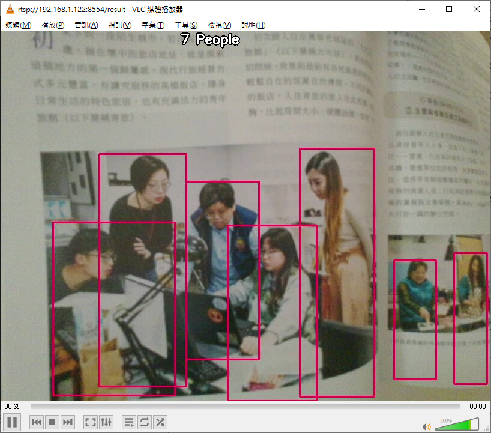

# Azure Percept for COVID
azureeyepeoplecountingmodule is an IoT Edge module for people counting with Azure Percept. Below is the sample result of the module.



To start, run the command below to build the module.

```
sudo docker build -t azureeyepeoplecountingmodule -f Dockerfile.
arm64v8 .
```

Then, run the command below to start the module.

```
sudo docker run -it -v /dev/bus/usb:/dev/bus/usb --device-cgroup-rule='c 189:* rmw' -p 8554:8554 azureeyepeoplecountingmodule
```

Please refer to https://github.com/microsoft/azure-percept-advanced-development/tree/main/azureeyemodule for more details.